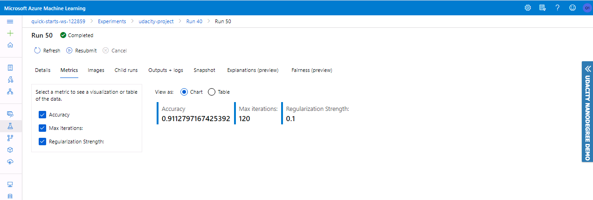
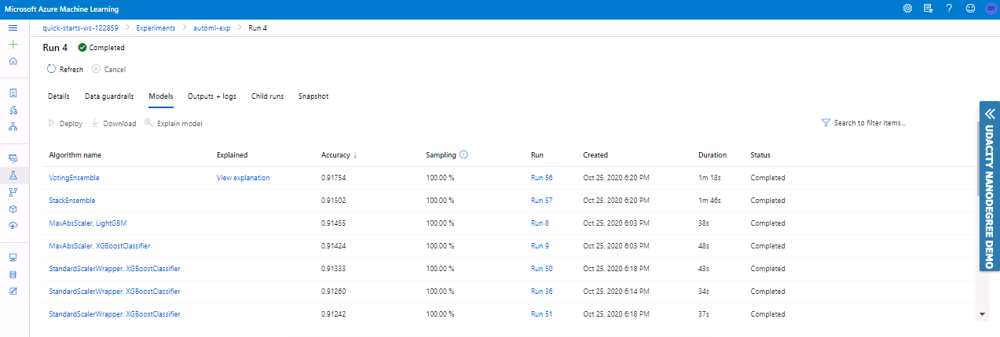
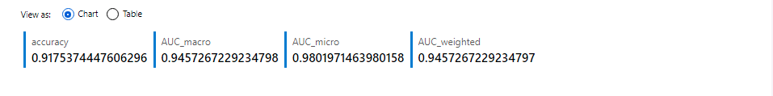
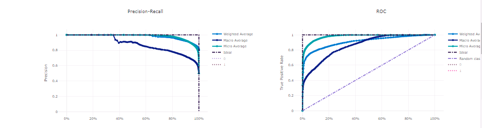
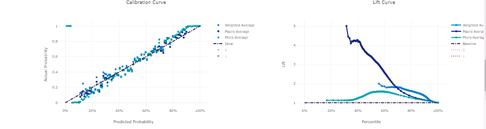
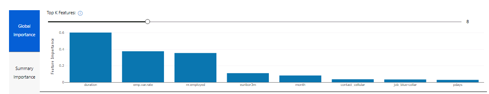
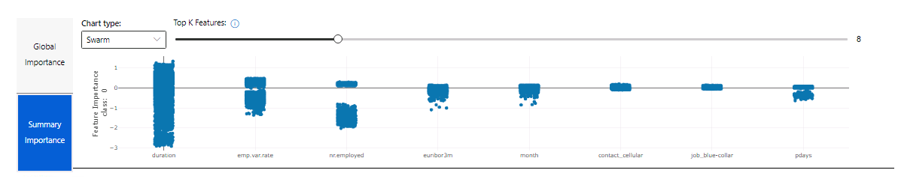
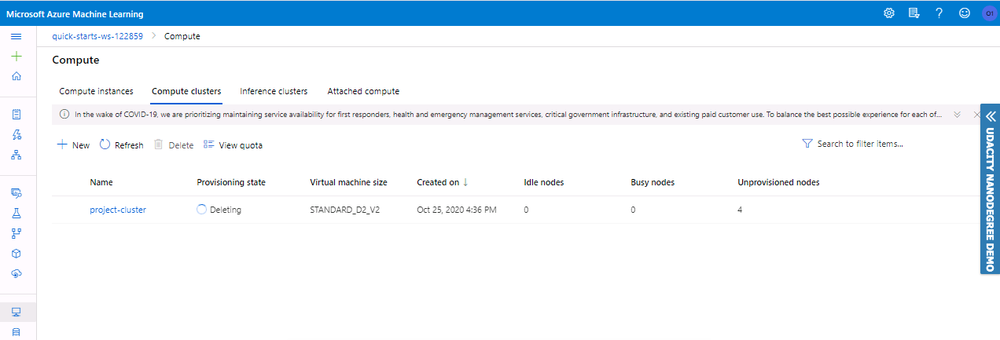

# Optimizing an ML Pipeline in Azure

## Overview
This project is part of the Udacity Azure ML Nanodegree.
In this project, we build and optimize an Azure ML pipeline using the Python SDK and a provided Scikit-learn model.
This model is then compared to an Azure AutoML run.

## Summary
This dataset contains financial and personal details of a Portugese bank's costumers.

We seek to predict whether a customer will subscribe to the bank term deposit or not.

We tried two approaches :

* Using a LogisticRegression model with scikit-learn, and tuning the model's hyperparameters using Azure HyperDrive.

* Using Azure AutoML to train different models and find the best one based on accuracy.

The best performing model was a Voting Ensemble found using the second approach.

## Scikit-learn Pipeline
First, we retrieve the dataset from the given url using TabularDataFactory class.

Then, we clean the data using the 'clean_data' method where we do some data preprocessing. Then, the dataset is split into 70% for training and 30% for testing.

We use sklearn's LogisticRegression Class to define the model and fit it.

Then, we define a SKLearn estimator to be later passed to the HyperDrive Config script. And a parameter sampler, which defines the hyperparameters we want to tune. In our case, we have the inverse regularization parameter (C), and the maximum number of iterations (max_iter).

We define a HyperDrive Config using the estimator, parameter sampler and an early termination policy. Then, we submit the experiment.

After the run is completed, we found that the best model has C=0.1, max_iter=150, and Accuracy=0.9112797167425392.

### Benefits of the chosen Parameter Sampler
We use a parameter sampler to define the different hyperparameters we want to tune, as well as the different values we want to test out (the search space).

For this project, I defined a discrete search space for both hyperparemeters (C and max_iter). I also used a Random sampling method. In random sampling, hyperparameter values are randomly selected from the defined search space. 

Hyperdrive can then try all the combinations of choices from the search space to do hyperparameter tuning and find the best model that gives us the highest accuracy.

Random sampling is a type of probability sampling where everyone in the entire target population has an equal chance of being selected, this allows for generalization or inferences to the larger population. Grid and random search are completely uninformed by past evaluations, unlike Bayesian Sampling. However to simplify the search, I chose a Random Parameter Sampler.

### Benefits of the chosen early termination policy
We use an early termiation policy to prevent experiments from running for a long time and using up resources. So, it improves computational efficiency.

For this project, I used a Bandit policy for early termination with the parameters evaluation_interval=2 and slack_factor=0.1.

The slack_factor is the amount of slack allowed with respect to the best performing training run. The evaluation_interval is the frequency for applying the policy.

## AutoML
To use AutoML in Azure, we first define a AutoMLConfig in which we specify the task, training dataset, label column name, primary metric, max concurrent iterations, and iterations.

Azure AutoML tried different models such as : RandomForests, BoostedTrees, XGBoost, LightGBM, SGDClassifier, VotingEnsemble, etc. 

The best model was a Voting Ensemble that has Accuracy=0.9170172267033548. 

Ensemble learning improves machine learning results and predictive performance by combining multiple models as opposed to using single models. The Voting Ensemble model predicts based on the weighted average of predicted class probabilities.

The best model had the following parameter values:
* **l1_ratio=0.8979591836734693**. Parameter in a [0,1] range weighting l1 vs l2 regularisation.
* **learning_rate='constant'**. Having a constant learning_rate, instead of adaptative learning rate.
* **loss='modified_huber'**. Modified Huber loss, default="".
* **max_iter=1000**. Maximum iterations.
* **n_jobs=1**. Number of parallel threads.
* **penalty='none'**. No penalty.
* **random_state=None**. random_state is the seed used by the random number generator. If None, the random number generator is the RandomState instance used by np.random.
* **learning_rate=0.1**. Default value for learning rate.
* **boosting_type='gbdt'**. Traditional Gradient Boosting Decision Tree.

Here are other metrics of the best model:

And the Top Features :

## Pipeline comparison
Overall, there wasn't a big difference in accuracy between AutoML and HyperDrive. For the HyperDrive model, we had an accuracy of 0.9113. Whereas, for the AutoML model, the accuracy was 0.9170. So, we only had a 0.0057 difference between the two approaches.

However, in terms of architecture, AutoML was superior. With AutoML, we tried many different models that we could not have tried using HyperDrive in the same amount of time. With only one config, we could test various models. If we wanted to do the same thing using HyperDrive, we would define a config for each model.

## Future work
For future experiments, I might try more hyperparameters for the HyperDrive model, and test different sampling methods as well as have a larger search space to maximize the search. I want to also try different models and see if I can get a better accuracy and train a more robust model for inferencing.

First, trying a Bayesian Parameter Sampler might improve model accuracy and optimize time spent on Hyperparameter Tuning since it keeps track of past evaluation results and uses them to choose the next values to test. Also, having a larger search space means more possible improvement in choosing the most optimal hyperparameter values, thus improving the accuracy. In the case of model choice, I used a simple Logistic Regression model. However, choosing a more complex model might help in improving the accuracy. Finally, doing some feature engineering might come in handy. We already have some features in the data, but exploring the data more, and extracting new features and maybe getting rid of features and don't contribute as much to the inferencing might help us train a more robust model.

For AutoML, I want to try implementing explicit model complexity limitations to prevent over-fitting. Also, test out different parameter values such as number of folds for Cross Validation. I also want to try working with raw data only and passing it to AutoML to see how it will handle it, if it will affect the chosen model and the model accuracy.

Reducing over-fitting is an important task that improves model accuracy. If a model is over-fitting, it might have a high accuracy with training data, but will fail when performing inferencing on test data.

## Proof of cluster clean up

